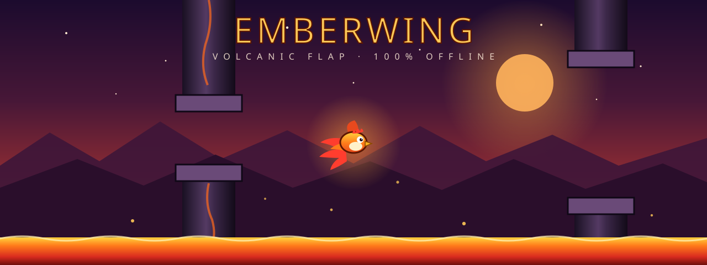

# EMBERWING — Volcanic Flap

A single-page, **100% offline** Flappy-Bird-style arcade game set in a living volcanic world.
Pick your heat, choose your bird, hold to flap, and dodge basalt rifts that drift, breathe, and sway.

**Zero assets, zero dependencies at runtime** — every pixel is drawn procedurally on `<canvas>` and every
sound is synthesized live with WebAudio. The production build is **one self-contained `index.html`** that
runs over `http(s)` *or* straight from disk (`file://`), forever.

---

## ▶ Play it instantly

| Way | How |
|---|---|
| **From disk** | Just **double-click `index.html`** — it *is* the complete game. Works offline, no build, no server |
| **Dev server** | `npm install && npm run dev` |
| **GitHub Pages** *(optional)* | Push `index.html` to a `gh-pages` branch — the game goes live at `https://<you>.github.io/flappy-bird-extra` (see below) |

## Controls

| Input | Action |
|---|---|
| `Space` / `↑` / `W` / click / tap | Flap — **hold to auto-flap** |
| `P` or `Esc` | Pause (auto-pauses when the tab loses focus) |
| `M` | Mute / unmute |
| `T` | Cycle world theme |
| `S` | Cycle bird |
| `1` `2` `3` | Pick heat level |

## Features

**Three heat levels** — each with its own physics, spacing, and its own **best score**:

- **WARMING** — floaty gravity, wide gaps, fat pillars. A gentle warm-up.
- **STANDARD** — the classic burn. Pipes start drifting at 18 pts, gaps tighten after 12, rifts begin to *breathe* at 15, and whole obstacles start to *sway* at 25.
- **CRAZY** — deceptively calm at first, then erupts: stick-thin to monstrosity-fat random pipes, chaotic spacing, breathing gaps and swaying pairs from the first minutes.

**Escalating chaos** — speed ramps every point (with velocity toasts), spawn rhythm and pipe widths
randomize as you score, and drifting pipes wake up *almost frozen* before slowly turning restless.
Amplitude, pace and range all grow with your score — always clamped so the game stays fair.

**SPICY mode** — a checkbox that sets the heat cards on fire, smolders the arena frame, and makes your
bird burn with rage. Spacing, widths and gap sizes get far wilder, and the hostile environment wakes at
**half** the normal threshold.

**Four birds that differ in every dimension, not just color:**

| Bird | Feel | Body | Signature |
|---|---|---|---|
| **EMBER** | Balanced | Classic round | Flame tail · springy *fwip-boing* |
| **FROSTWING** | Floaty | Chubby, slow wingbeats | Crystal tail · **makes it snow in any world** · glass-shatter death |
| **VOLT** | Zippy | Slim, fast cadence | Lightning tail + arcs · electric *zap-zip* · short-circuit death |
| **ONYX** | Heavy | Big & wide, bends nearby embers into its void | Smoke trail · ground shadow · funeral-gong death |

Each bird has its own gravity, flap strength, auto-flap rhythm, rotation lag, hitbox, **funny flap voice
and funnier death cry** (sad trombones included).

**Three worlds**, each repainting the environment *and* the whole UI, with its own menu ambience:

- **EMBER** — volcanic dusk, magma veins, bubbling lava, rising embers, low rumble with distant booms.
- **FROST** — arctic dusk, falling snow, frozen shard-floor, cold fog, airy wind with sparse chimes.
- **NEON** — cyberpunk skyline, data-rain, circuit-grid energy floor, synth-hum ambience.

**Game feel & furniture** — screen shake, hit-flash, particle bursts, score boings whose pitch climbs as
you survive, milestone toasts (*THE RIFTS BREATHE!*, *THE STONE SWAYS!*), medals (Bronze → Platinum),
per-heat best scores persisted in `localStorage`, themed pause / game-over screens, and a built-in
load-failure reporter so the page never dies silently.

## Architecture

```
index.html          ← the game. Inline CSS + JS, canvas renderer, WebAudio SFX.
                      Build output (dist/index.html) is this same self-contained file.
src/                ← safe pipeline stubs so `npm run build` always succeeds
banner.svg          ← this README's key art
```

> **Why one file?** The game was engineered to survive anything: no module scripts, no CDN fonts, no
> fetches — so it runs in any browser, from any origin (including `file://`), even decades from now.
> Fonts are a deliberately crafted system stack (Impact / Arial Black display + Trebuchet MS body)
> chosen to need no downloads.

## Tech

- Vanilla TypeScript-grade JavaScript on a single `<canvas>` (devicePixelRatio-aware, `requestAnimationFrame` loop, clamped `dt`)
- WebAudio synthesis for every SFX and the themed ambience beds
- Responsive layout: full-bleed portrait on phones, framed portrait on tablets, wide **16:10 arena** on desktop

The game is live at
`https://nimabhk.github.io/flappy-bird-extra` and playable from any device.

## License

Personal project — do whatever you like with it. A star ⭐ and a credit are appreciated.
